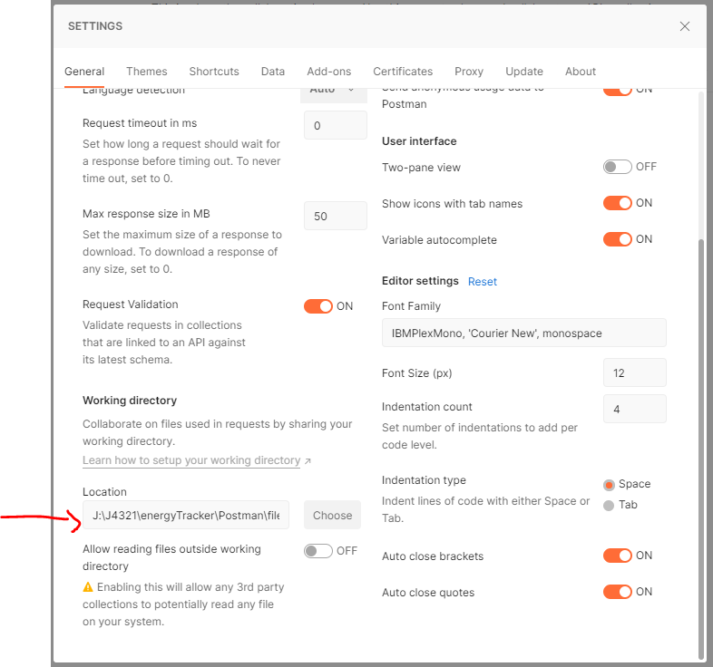

# API testing

## Install & Setup Postman

https://www.postman.com/downloads/

update the save location of postman files to:  
`J:\J4321\energyTracker\Postman\files`

## Example: energyTracker

request authentification token first. for "body" use: "raw" --> "JSON". 
