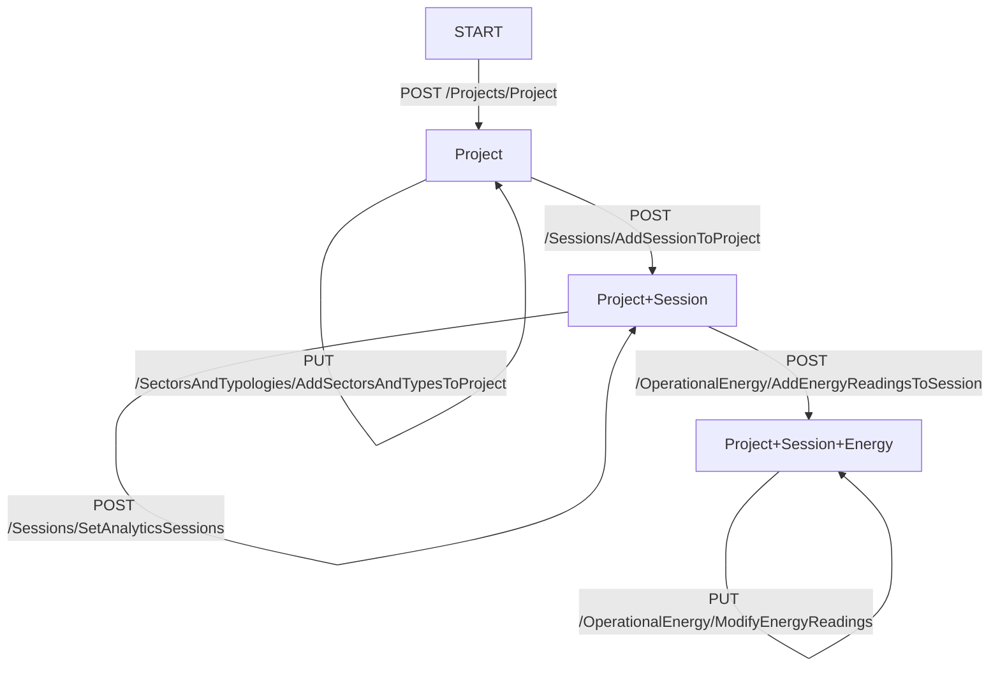
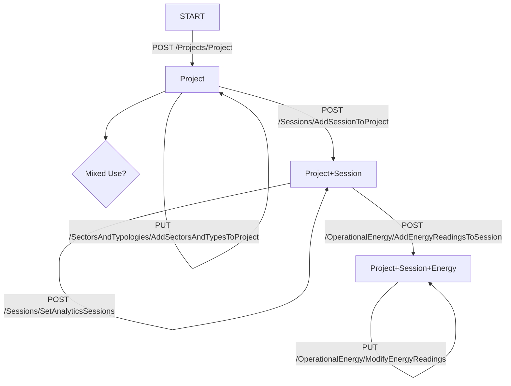
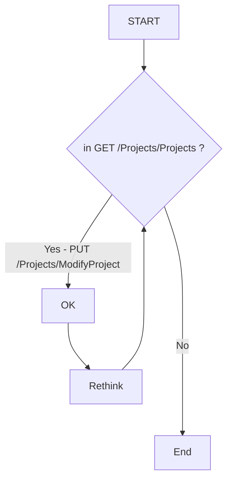
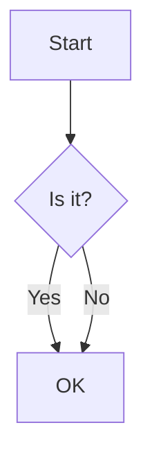
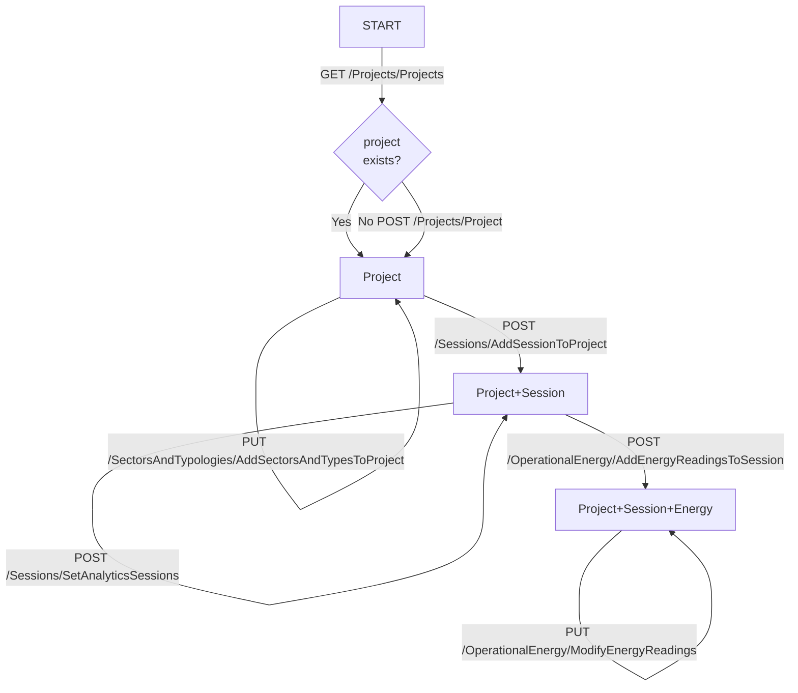

---
jupytext:
  formats: md:myst
  text_representation:
    extension: .md
    format_name: myst
    format_version: 0.13
    jupytext_version: 1.13.6
kernelspec:
  display_name: Python [conda env:ipyvuetify-vjsf]
  language: python
  name: conda-env-ipyvuetify-vjsf-py
---

+++ {"tags": []}

# Energy Tracker testing and Development

## [energy tracker API - Swagger UI](https://energytrackerapi20211206093928.azurewebsites.net/swagger/index.html)

## Questions for Matt

- generally, it would be useful to add references for definitions (ideally in the schema) of terms (e.g. in `/SectorsAndTypologies​/AddSectorsAndTypesToProject`): 
    - use: 
    - category: 
    - sector: 
    - type: 
    - ^ ideally the above would all have accompanying references from literature
- is UTC time used generally (current working assumption). required for expiry response for auth.
	- if yes, add to description in schema.
- when project is initiated with POST /Projects/Project, in the sample request: ```{"yourReferenceKey": "MyKey"}```, it should be ```{"referenceKey": "MyKey"}```
- ProjectCreationShell --> accessType: is there an enum of allowed values
- "isFinalDesign" within Sessions
	- can't see how to set "isFinalDesign" (its not in the PUT or POST commands within Sessions)
	- within a Session, we should define the convention within the schema for how "isFinalDesign" can be used. suggest that:
		- for a given "methodology", there can only be 1no "isFinalDesign" 
		- can this be enforced by validation within the schema? 
	


  

## Single use building



## Mixed use building



+++



+++



+++

## Energy Tracker



```{code-cell} ipython3
import pathlib
import subprocess
import requests
import json
import toml
from urllib.request import urlopen
import requests
from uuid import uuid4

# UI stuff
# uncomment next lines to enable hot reloading of vue template(s). (needs the watchdog package)
import ipywidgets as widgets
import ipyvue
import ipyvuetify as v
import traitlets

ipyvue.watch('.')

class TryVjsf(v.VuetifyTemplate):
    template_file = "try_vjsf.vue"

    vjsf_loaded = traitlets.Bool(False).tag(sync=True)
    form_data = traitlets.Dict().tag(sync=True)
    schema = traitlets.Dict().tag(sync=True)
    valid = traitlets.Bool(False).tag(sync=True)
```

```{code-cell} ipython3
def make_pydantic_model(fpth_schema: pathlib.Path, fpth_pydantic: pathlib.Path, di_schema):
    
    with open(fpth_schema, 'w', encoding='utf-8') as f:
        json.dump(di_schema, f, ensure_ascii=False, indent=4)

    cmd = f"datamodel-codegen --input {str(fpth_schema)} --input-file-type openapi --output {str(fpth_pydantic)}"
    return subprocess.run(cmd, shell=True)

def update_pydantic_model(fpth_model: pathlib.Path, str_insert="", line_no=12):
    li_model = fpth_model.read_text().splitlines()
    li_insert = str_insert.splitlines()
    li = li_model[0:line_no] + li_insert + li_model[line_no:]
    str_model = '\n'.join(li)
    fpth_model.write_text(str_model)
    return fpth_model


IP_ADDRESS = 'https://energytrackerapi20211206093928.azurewebsites.net/'
URL_SWAGGER = IP_ADDRESS + "swagger/v1/swagger.json"
KEYS = toml.load('energytracker-hosts.toml')

url = f"{IP_ADDRESS}/authentication/RequestAuthToken"
payload = json.dumps(KEYS)
headers = {
  'Content-Type': 'application/json',
  'Cookie': 'ARRAffinity=90f0e60f8730156a32a3d396a6ede00f2b22e75a09fa42984a1ee0fd1b1cc131; ARRAffinitySameSite=90f0e60f8730156a32a3d396a6ede00f2b22e75a09fa42984a1ee0fd1b1cc131'
}

def get_token():
    response = requests.request("POST", url, headers=headers, data=payload)
    return response.json()['token']
token = get_token()

response = urlopen(URL_SWAGGER)
di_swagger = json.loads(response.read())
fpth_schema = pathlib.Path('schemas.json')
fpth_pydantic = fpth_schema.with_suffix('.py')
fpth_schema.write_text(json.dumps(di_swagger, indent = 4) )
make_pydantic_model(fpth_schema, fpth_pydantic, di_swagger)

str_insert = """
# insert
import stringcase
def to_sentence(string: str) -> str:
    return stringcase.sentencecase(string).lower()

class BaseModel(BaseModel):
    class Config:
        alias_generator = to_sentence
        allow_population_by_field_name = True
# ----
"""
fpth_pydantic = update_pydantic_model(fpth_pydantic, str_insert=str_insert)
```

```{code-cell} ipython3
from schemas import ProjectAnalyticsBundle, AnalyticSession, OperationalEnergyCreationShell, OperationalEnergyComponent
?OperationalEnergyComponent
```

```{code-cell} ipython3
schema = OperationalEnergyComponent().schema()
schema['properties']['use']['readOnly'] = True
form = TryVjsf(schema=schema)
form
```

```{code-cell} ipython3
OperationalEnergyComponent()
```

```{code-cell} ipython3
schema
```

```{code-cell} ipython3
my_form.form_data = {'power generators': [],
 'non electric energy consumers': [],
 'electric energy consumers': [],
 'session id': str(uuid4())}
```

```{code-cell} ipython3
from copy import deepcopy

def update_ui_schema(schema):
    s = deepcopy(schema)
    s['properties']['total electricity use']['readOnly'] = True
    s['properties']['total electricity use']['default'] = 0
    s['properties']['total renewable contribution']['readOnly'] = True
    s['properties']['total non electric use']['readOnly'] = True
    s['properties']['total']['readOnly'] = True
    return s

class TryVjsf(v.VuetifyTemplate):
    template_file = "try_vjsf.vue"
    
    vjsf_loaded = traitlets.Bool(False).tag(sync=True)
    form_data = traitlets.Dict().tag(sync=True)
    schema = traitlets.Dict().tag(sync=True)
    valid = traitlets.Bool(False).tag(sync=True)
```

```{code-cell} ipython3
data = OperationalEnergyCreationShell(sessionId=str(uuid4()))
schema = data.schema()
schema = update_ui_schema(schema)
my_form = TryVjsf(schema=schema, form_data=json.loads(data.json(by_alias=True)))

my_form
```

```{code-cell} ipython3
data.dict()
```

```{code-cell} ipython3

```

```{code-cell} ipython3

```

```{code-cell} ipython3
my_form.form_data
```

```{code-cell} ipython3
data.dict()
```

```{code-cell} ipython3

```

```{code-cell} ipython3

```

```{code-cell} ipython3

```

```{code-cell} ipython3
import pathlib
import json
import subprocess
import stringcase

fdir = pathlib.Path('.')
key = 'AnalyticSession'
fpth_json = fdir / (key + '.json')
schemas = di_swagger['components']['schemas']
fpth_py = fdir / (stringcase.snakecase(fpth_json.stem)+'.py')
obj = {}
obj["$id"] = fpth_json.name
obj["$schema"] = "http://json-schema.org/draft-07/schema#"
obj["title"] = key
obj = obj | schemas[key]

with open(fpth_json, 'w') as outfile:
    json.dump(obj, outfile, indent=2)

cmd = f"datamodel-codegen --input {str(fpth_json)} --input-file-type openapi --output {str(fpth_py)}"
#cmd = f"datamodel-codegen --input {str(obj)} --input-file-type jsonschema --output {str(fpth_py)}"
cmd = f"datamodel-codegen --input {str(fpth_json)} --input-file-type jsonschema"
subprocess.run(cmd, shell=True)
```

```{code-cell} ipython3
# OperationalEnergyCreationShell
# 
```

```{code-cell} ipython3
di_swagger['openapi']
```

```{code-cell} ipython3
di_swagger['components']['schemas']['OperationalEnergyCreationShell']
```

```{code-cell} ipython3
obj
```

```{code-cell} ipython3
import sys
sys.path.append('/mnt/c/engDev/git_mf/ipyautoui/src')
```

```{code-cell} ipython3
from ipyautoui import AutoUi
```

```{code-cell} ipython3
from analytic_session import AnalyticSession
```

```{code-cell} ipython3
AnalyticSession().schema()
```

```{code-cell} ipython3
AutoUi(AnalyticSession())
```

```{code-cell} ipython3
schemas['SessionCreationShell']
```

```{code-cell} ipython3

```

```{code-cell} ipython3

```

```{code-cell} ipython3
cmd = f"datamodel-codegen  --input energyTracker/person1.json --input-file-type jsonschema --output energyTracker/model1.py"
subprocess.run(cmd, shell=True)
```

```{code-cell} ipython3
?json.dump
```

```{code-cell} ipython3

```

```{code-cell} ipython3
di_swagger['components'].keys()
```

```{code-cell} ipython3
fdir = pathlib.Path('energyTracker')
key = 'schemas'
fpth_json = fdir / (key + '.json')
schemas = di_swagger['components']
fpth_py = fdir / (stringcase.snakecase(fpth_json.stem)+'.py')
obj = schemas[key]
obj['title'] = key

with open(fpth_json, 'w') as outfile:
    json.dump(obj, outfile)
    
cmd = f"datamodel-codegen --input {str(fpth_json)} --input-file-type jsonschema --output {str(fpth_py)}"
subprocess.run(cmd, shell=True)
```

```{code-cell} ipython3
import requests
import json

url = "https://energytrackerapi20211206093928.azurewebsites.net/authentication/RequestAuthToken"

payload = json.dumps({
  "appIdent": "Postman",
  "apiKey": "xMpFP1oXVUUkfqj61HaQWQTVoiyUFNNj82tQqbiyndg=",
  "claimantSid": "cba1011d-1b5d-4d10-88ac-d69978977635",
  "claimantName": "Max Fordham"
})
headers = {
  'Content-Type': 'application/json',
  'Cookie': 'ARRAffinity=90f0e60f8730156a32a3d396a6ede00f2b22e75a09fa42984a1ee0fd1b1cc131; ARRAffinitySameSite=90f0e60f8730156a32a3d396a6ede00f2b22e75a09fa42984a1ee0fd1b1cc131'
}

response = requests.request("POST", url, headers=headers, data=payload)
js = json.loads(response.text)
debug(js)
```

```{code-cell} ipython3
r = requests.get(f"{IP_ADDRESS}/units/regions/getregionlist/")
```

```{code-cell} ipython3
from devtools import debug
```

```{code-cell} ipython3

```

```{code-cell} ipython3

```
