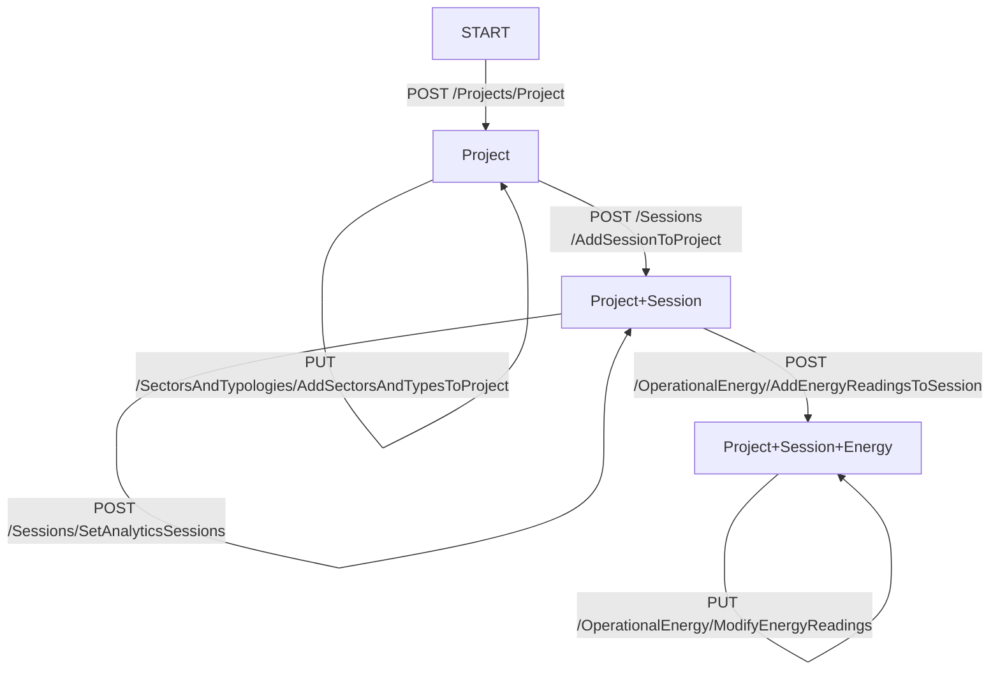
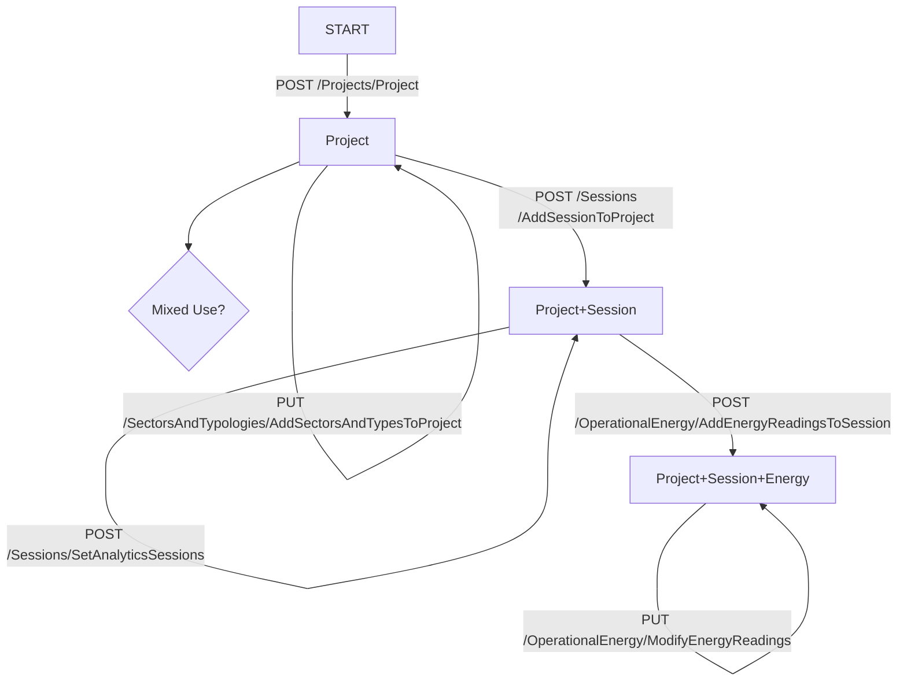

---
jupytext:
  formats: md:myst
  text_representation:
    extension: .md
    format_name: myst
    format_version: 0.13
    jupytext_version: 1.13.6
kernelspec:
  display_name: Python [conda env:ipyautoui]
  language: python
  name: conda-env-ipyautoui-xpython
---

+++ {"tags": []}

# Energy Tracker testing and Development

## [energy tracker API - Swagger UI](https://energytrackerapi20211206093928.azurewebsites.net/swagger/index.html)

Simple flowchart for creating a session for a

## Single use building



## Mixed use building



```{code-cell}
import requests
import toml
IP_ADDRESS = 'https://energytrackerapi20211206093928.azurewebsites.net/'
KEYS = toml.load('energytracker-hosts.toml')
```

```{code-cell}
def get_token():
    hosts = get_hosts()
```

```{code-cell}
from urllib.request import urlopen
import requests
import json

url = f"{IP_ADDRESS}/authentication/RequestAuthToken"
payload = json.dumps(KEYS)
headers = {
  'Content-Type': 'application/json',
  'Cookie': 'ARRAffinity=90f0e60f8730156a32a3d396a6ede00f2b22e75a09fa42984a1ee0fd1b1cc131; ARRAffinitySameSite=90f0e60f8730156a32a3d396a6ede00f2b22e75a09fa42984a1ee0fd1b1cc131'
}

response = requests.request("POST", url, headers=headers, data=payload)
token = response.json()['token']
```

```{code-cell}
url = f"{IP_ADDRESS}/Analytics/GetProjectAnalyticsBundle"
response = requests.request("GET", url)
response
```

```{code-cell}
url = "https://energytrackerapi20211206093928.azurewebsites.net/swagger/v1/swagger.json"
response = urlopen(url)
di_swagger = json.loads(response.read())
```

```{code-cell}
import json
import pathlib
import subprocess
fpth_swagger = pathlib.Path('swagger.json')

def make_pydantic_model(fpth_schema: pathlib.Path, di_schema):
    fpth_py = fpth_schema.with_suffix('.py')
    with open(fpth_schema, 'w', encoding='utf-8') as f:
        json.dump(di_schema, f, ensure_ascii=False, indent=4)

    cmd = f"datamodel-codegen --input {str(fpth_schema)} --input-file-type openapi --output {str(fpth_py)}"
    return subprocess.run(cmd, shell=True)
     
# fpth_schema = pathlib.Path('ProjectAnalyticsBundle.json')
# make_pydantic_model(fpth_schema, di_swagger['components']['schemas']['ProjectAnalyticsBundle'])

fpth_schema = pathlib.Path('schemas.json')
make_pydantic_model(fpth_schema, di_swagger)
```

```{code-cell}
di_swagger['components']['schemas']['ProjectAnalyticsBundle']
```

```{code-cell}
from schemas import ProjectAnalyticsBundle, AnalyticSession, OperationalEnergyCreationShell, OperationalEnergyComponent
?OperationalEnergyComponent
```

```{code-cell}

```

```{code-cell}
# uncomment next lines to enable hot reloading of vue template(s). (needs the watchdog package)
import ipywidgets as widgets
import ipyvue
ipyvue.watch('.')

import ipyvuetify as v
import traitlets

class TryVjsf(v.VuetifyTemplate):
    template_file = "try_vjsf.vue"
    
    vjsf_loaded = traitlets.Bool(False).tag(sync=True)
    form_data = traitlets.Dict(default_value={}).tag(sync=True)
    schema = traitlets.Dict().tag(sync=True)
    valid = traitlets.Bool(False).tag(sync=True)
```

```{code-cell}

```

```{code-cell}
from uuid import uuid4
uuid4()
```

```{code-cell}
schema = OperationalEnergyCreationShell(sessionId=uuid4()).schema()

my_form = TryVjsf(schema=schema)
my_form
```

```{code-cell}
import pathlib
import json
import subprocess
import stringcase

fdir = pathlib.Path('.')
key = 'AnalyticSession'
fpth_json = fdir / (key + '.json')
schemas = di_swagger['components']['schemas']
fpth_py = fdir / (stringcase.snakecase(fpth_json.stem)+'.py')
obj = {}
obj["$id"] = fpth_json.name
obj["$schema"] = "http://json-schema.org/draft-07/schema#"
obj["title"] = key
obj = obj | schemas[key]

with open(fpth_json, 'w') as outfile:
    json.dump(obj, outfile, indent=2)

cmd = f"datamodel-codegen --input {str(fpth_json)} --input-file-type openapi --output {str(fpth_py)}"
#cmd = f"datamodel-codegen --input {str(obj)} --input-file-type jsonschema --output {str(fpth_py)}"
cmd = f"datamodel-codegen --input {str(fpth_json)} --input-file-type jsonschema"
subprocess.run(cmd, shell=True)
```

```{code-cell}
# OperationalEnergyCreationShell
# 
```

```{code-cell}
di_swagger['openapi']
```

```{code-cell}
di_swagger['components']['schemas']['OperationalEnergyCreationShell']
```

```{code-cell}
obj
```

```{code-cell}
import sys
sys.path.append('/mnt/c/engDev/git_mf/ipyautoui/src')
```

```{code-cell}
from ipyautoui import AutoUi
```

```{code-cell}
from analytic_session import AnalyticSession
```

```{code-cell}
AnalyticSession().schema()
```

```{code-cell}
AutoUi(AnalyticSession())
```

```{code-cell}
schemas['SessionCreationShell']
```

```{code-cell}

```

```{code-cell}

```

```{code-cell}
cmd = f"datamodel-codegen  --input energyTracker/person1.json --input-file-type jsonschema --output energyTracker/model1.py"
subprocess.run(cmd, shell=True)
```

```{code-cell}
?json.dump
```

```{code-cell}

```

```{code-cell}
di_swagger['components'].keys()
```

```{code-cell}
fdir = pathlib.Path('energyTracker')
key = 'schemas'
fpth_json = fdir / (key + '.json')
schemas = di_swagger['components']
fpth_py = fdir / (stringcase.snakecase(fpth_json.stem)+'.py')
obj = schemas[key]
obj['title'] = key

with open(fpth_json, 'w') as outfile:
    json.dump(obj, outfile)
    
cmd = f"datamodel-codegen --input {str(fpth_json)} --input-file-type jsonschema --output {str(fpth_py)}"
subprocess.run(cmd, shell=True)
```

```{code-cell}
import requests
import json

url = "https://energytrackerapi20211206093928.azurewebsites.net/authentication/RequestAuthToken"

payload = json.dumps({
  "appIdent": "Postman",
  "apiKey": "xMpFP1oXVUUkfqj61HaQWQTVoiyUFNNj82tQqbiyndg=",
  "claimantSid": "cba1011d-1b5d-4d10-88ac-d69978977635",
  "claimantName": "Max Fordham"
})
headers = {
  'Content-Type': 'application/json',
  'Cookie': 'ARRAffinity=90f0e60f8730156a32a3d396a6ede00f2b22e75a09fa42984a1ee0fd1b1cc131; ARRAffinitySameSite=90f0e60f8730156a32a3d396a6ede00f2b22e75a09fa42984a1ee0fd1b1cc131'
}

response = requests.request("POST", url, headers=headers, data=payload)
js = json.loads(response.text)
debug(js)
```

```{code-cell}
r = requests.get(f"{IP_ADDRESS}/units/regions/getregionlist/")
```

```{code-cell}
from devtools import debug
```

```{code-cell}

```

```{code-cell}

```
