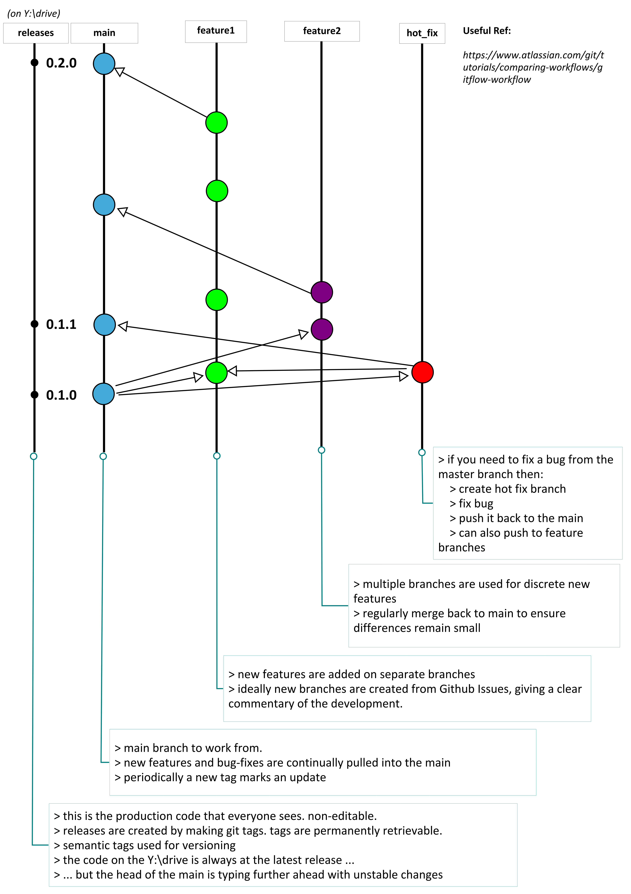

# Git

## Git Workflow

This shows our git workflow which we believe to be the best practice when working on
new functionality in code repositories.

## Merging branches

Let's say that we have been working on a branch called "Adding Tests", then we merge this to dev by doing:

- in local dev repo
- switch/checkout to Adding Tests branch
- pull changes
- switch/checkout to dev branch 
  - select merge changes to Adding Tests branch
- push dev to git server (git dev now up-to-date)
