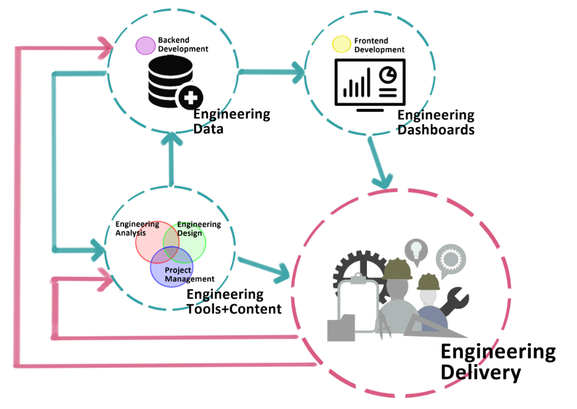

Max Fordham is using code to:

- streamline workflows
- automate software (i.e. pyRevit, IES VEscripts, Rhino + Grasshopper + Python)
- develop robust engineering tools
- communicate insight from data and create an ongoing feedback loop from lessons learnt.

This drive came from a desire to "stop re-inventing the wheel". This statement has 2-fold implications to internal software development:

1. By creating internally developed code we are formally recording common engineering processes that are observed on many projects
2. Many of the technical answers to the problems that we face exist in the external world as open-source code. Use it!

**Max Fordham Engineering Development Best Practice**

This documentation aims to provide high-level, non-verbose notes outlining Max Fordham's engineering software development infrastructure.
Links to external sources and standards to describe the approach are preferred where possible.
The intended audience are those contributing-to and maintaining internal development tools, or external parties and collaborators interested in our approach.
Code snippets are encouraged.



```{admonition} Secret config data
each individual user should have a file saved here:  
```/mfcode_docs/book/docs/_secret_config.toml```  
that follows the same format as:  
```/mfcode_docs/book/docs/_secret_config_template.toml```  
with their secret config details.  
_secret_config.toml should not be shared.  
jinja style pseudo-code is used to indicate what vars from the _secret_config.toml file should be used.
```
