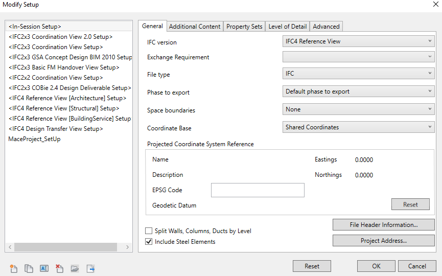
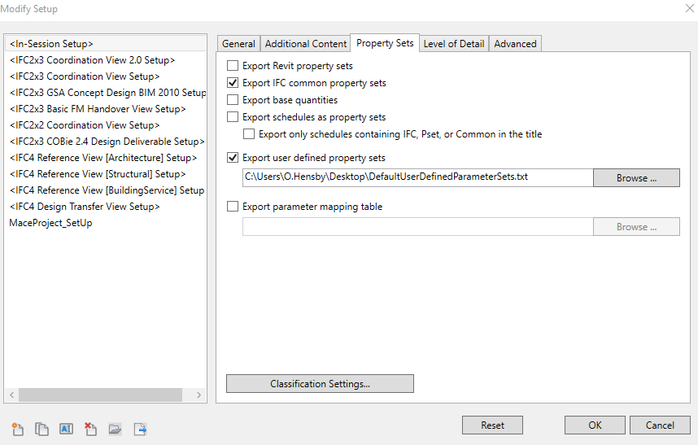
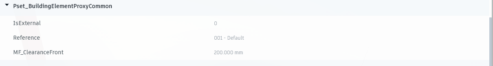

# Revit Resources

exporting to IFC 

- [exporting-ifc-from-revit-part-3-user-defined-properties](https://bimcorner.com/exporting-ifc-from-revit-part-3-user-defined-properties/)

## Exporting to IFC with Units

- [project-units](https://standards.buildingsmart.org/IFC/RELEASE/IFC4/ADD2_TC1/HTML/link/project-units.htm)
- [basic-unit-declaration](https://standards.buildingsmart.org/IFC/DEV/IFC4_2/FINAL/HTML/annex/annex-e/basic-unit-declaration.htm)
- [ifcmeasureresource](https://standards.buildingsmart.org/IFC/RELEASE/IFC4/FINAL/HTML/schema/ifcmeasureresource/content.htm)

## Adding conversion to a unit

- 

## Custom PropertySets vs Extending PropertySets

Defining property set in user defined property sets txt file.
 

Set up in Revit's IFC exporter

Set up in Property sets tab.

We see that in IFC viewer that the IFC properties within the property set are not overwritten.
The user defined property we defined in the property set txt file is added.

However, when looking at a Space, we see that the "Name" property is used multiple times for the different property sets.

Maybe it would be best to create user-defined property sets based off of the IFC property sets and extend them with the properties we wish.

## Export to IFC with correct IFC classifcations

- [Exporting to IFC correctly](https://knowledge.autodesk.com/support/revit/learn-explore/caas/CloudHelp/cloudhelp/2020/ENU/Revit-DocumentPresent/files/GUID-7119A8C3-A0EE-4568-8C35-750410D867C9-htm.html)
- [Useful Tutorial on exporting to Ifc](https://www.youtube.com/watch?v=UemlqhPmcW4)

Firstly, add "IfcExportAs" and "IfcExportType" to the Shared Parameters file. 

To assign the correct Ifc class to a Revit object, we will need to add these two parameters to it and then put the correct
Ifc class within the "IfcExportAs" field input. For example, we will want to assign IfcBoiler to a Revit Boiler family object.

Some Ifc classes have enumerations associated within them. For example, IfcBoiler has IfcBoilerType. If we want, we can add the type of boiler
of boiler where all the types are given under IfcBoilerTypeEnum. We can choose the type and then add it to the parameter "IfcExportType".

After this, the Revit object will be correctly mapped to the IFC file.

Note: Under File -> Export -> Options -> Ifc Options we can also assign Ifc Classes, however, anything selections in here will be overwritten
if we define the Ifc class within the family using the "IfcExportAs" and "IfcExportType" parameters.

## Shared Parameter File

https://resources.imaginit.com/building-solutions-blog/investigating-revits-shared-parameter-file
https://knowledge.autodesk.com/support/revit/troubleshooting/caas/sfdcarticles/sfdcarticles/Why-the-DATACATEGORY-column-is-empty-in-shared-parameter-txt-file.html

- "GROUP" is used only to make the SharedParameter file editor in Revit easier to navigate
- "DATACATEGORY" is used only when the "DATATYPE" == <familytype>. At MF this is rarely (never!?) used.