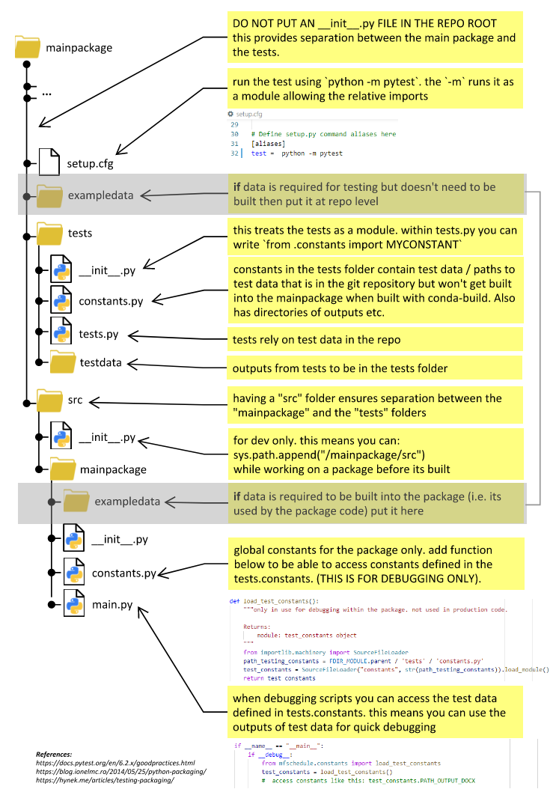

# Testing

All built packages should have testing.

## Managing Test Data

Keeping track of the data that is used for debugging and testing can create lots of confusion! 
It is suggested that the convention outlined in the image below is employed:



copy and pastable code snippets from those shown above are:

_mainpackage/constants.py_
```python
def load_test_constants():
    """only in use for debugging within the package. not used in production code.

    Returns:
        module: test_constants object
    """
    from importlib.machinery import SourceFileLoader
    path_testing_constants = FDIR_MODULE.parent / 'tests' / 'constants.py'
    test_constants = SourceFileLoader("constants", str(path_testing_constants)).load_module()
    return test_constants
```

_mainpackage/main.py_
```python
if __name__ == "__main__":
    if __debug__:
        from mfschedule.constants import load_test_constants
        test_constants = load_test_constants()
        #  access constants like this: test_constants.PATH_OUTPUT_DOCX
```